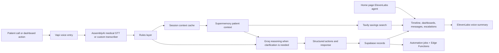
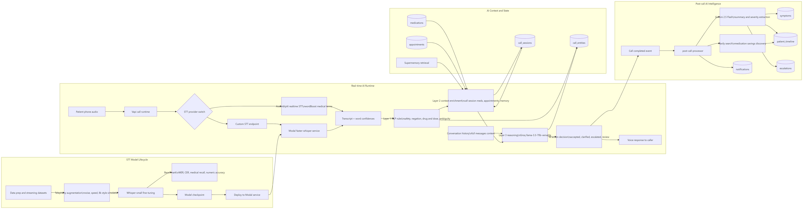

# CareCallerAI

- CareCallerAI is a multilingual patient monitoring and clinician operations app built for voice-first care workflows.
- It combines live calling, structured AI extraction, memory, web enrichment, timeline tracking, appointment orchestration, and dashboard UX in one stack.
- The goal is simple: let autonomous care agents keep moving fast without losing patient context.

## What The Project Does

- Runs patient-facing and clinician-facing dashboards with English and Spanish support.
- Handles voice interactions through Vapi and ElevenLabs.
- Preserves patient context across calls with Supermemory.
- Searches the live web with Tavily to surface medication savings and assistance programs.
- Turns calls, corrections, messages, appointments, and escalations into a single patient timeline.
- Lets clinicians act from one place instead of jumping across tools.

## Key Features

- `Patient dashboard`
  - Secure PIN-gated access.
  - Monitoring overview with severity, response window, next touchpoint, and team readiness.
  - Medication list, symptoms, appointments, care team, timeline, and patient messaging.
  - Real-time escalation updates via Supabase subscriptions.
  - Spoken care summary generated from the latest patient state.

- `Clinician workspace`
  - Open escalations, recent call transcript summaries, patient messages, and timeline in one view.
  - Symptom-aware appointment recommendations.
  - Appointment editing, rescheduling, and follow-up planning.
  - Action-oriented layout for reviewing severity and deciding the next move quickly.

- `Voice AI`
  - Vapi-powered live call orchestration.
  - Layered decision pipeline: rules first, cached context second, Groq reasoning only when needed.
  - Immediate rule-based escalation for urgent safety signals without waiting on an LLM.
  - English/Spanish live conversational agent on the home page using ElevenLabs.
  - Dashboard voice summaries rendered with ElevenLabs text-to-speech.

- `Context and memory`
  - Supermemory stores patient corrections and makes them available in future interactions.
  - Memory is queried by category: profile, affordability, adherence, and clinical history.
  - Call sessions are pre-cached with memory, active medications, and scheduled appointments before the conversation starts.

- `Medication savings enrichment`
  - Tavily searches live savings programs, coupons, copay cards, and assistance options.
  - Queries are enriched with patient memory and symptom context, not just the raw drug name.
  - Results are deduped, cached in Supabase, and refreshed when stale.

- `Workflow automation`
  - Calls, escalations, corrections, and appointment changes emit automation jobs.
  - Supabase Edge Functions can pick up downstream work such as post-call processing, correction handling, escalation handling, and appointment monitoring.
  - Patient corrections update records, timeline entries, and memory together so context stays consistent.

- `Scheduling intelligence`
  - Doctor recommendations are generated from symptom-to-specialty rules plus a doctor schedule CSV.
  - Options are ranked by specialty match, distance, and next available opening.
  - Booking creates normal appointments inside the existing CareCaller flow.

## AI Mermaid Diagram

## Innovations Worth Calling Out

- `Autonomous agents without context loss`
  - Supermemory keeps patient facts available across sessions.
  - Corrections are written back to memory so the next call inherits the updated truth.
  - Vapi call sessions are preloaded with memory, meds, and appointments before the model responds.

- `Fast-first voice pipeline`
  - Urgent safety phrases can trigger escalation before any LLM call.
  - High-confidence utterances stay on a fast path.
  - Groq is only used when confidence drops, contradictions appear, medications are mentioned, or numeric ambiguity is detected.

- `Context-aware savings search`
  - Tavily is not used as a generic search box.
  - Queries are shaped by affordability memory, adherence issues, symptoms, and medication context.
  - This makes savings results more relevant than a plain drug-name lookup.

- `Two different ElevenLabs roles`
  - ElevenLabs conversational AI powers the live homepage voice agent.
  - ElevenLabs text-to-speech powers spoken patient summaries inside the dashboard.

- `Human correction loop`
  - Patients can correct medication or dose information.
  - The correction updates records, gets logged on the timeline, enters memory, and triggers downstream automation.

- `Ops-ready clinician flow`
  - Escalations, transcripts, scheduling, recommendations, and patient messaging live in one workspace.
  - The UI is structured for action, not just display.

## Product Improvements In This Version

- Cleaner patient and clinician dashboards with stronger visual hierarchy.
- Better mobile spacing and calmer glass-surface UI.
- Dedicated voice summary card in the patient sidebar.
- Live homepage voice entry point for English and Spanish.
- More explicit monitoring states, response windows, and next-step cues.
- Stronger linkage between timeline events, savings enrichment, and care-team workflows.

## Stack

- `Frontend`: Next.js 15, React 19, TypeScript, Tailwind CSS
- `Data + auth`: Supabase
- `Voice orchestration`: Vapi
- `Speech`: AssemblyAI medical STT, ElevenLabs conversational AI, ElevenLabs TTS
- `Reasoning`: Groq
- `Structured summarization utilities`: Gemini
- `Memory`: Supermemory
- `Live web enrichment`: Tavily

## Important Integrations

- `ElevenLabs`
  - `ELEVENLABS_VOICE_ID` for dashboard TTS summaries.
  - `ELEVENLABS_CONVERSATIONAL_AGENT_ID` for the homepage live conversational agent.
  - Optional signed URL flow keeps the conversational agent private.

- `Tavily`
  - Pulls live medication savings data from targeted domains.
  - Stores enriched results for reuse and freshness control.

- `Supermemory`
  - Stores durable patient context.
  - Retrieves compact memory slices for profile, affordability, adherence, and clinical history.

- `Vapi`
  - Handles assistant config, call lifecycle webhooks, and the custom LLM callback.
  - Signature verification is included for webhook safety.

## Quick Start

- Install dependencies:
  - `npm install`

- Add env values in `.env`:
  - `NEXT_PUBLIC_SUPABASE_URL`
  - `NEXT_PUBLIC_SUPABASE_PUBLISHABLE_KEY`
  - `SUPABASE_SECRET_KEY` or `SUPABASE_SERVICE_ROLE_KEY`
  - `VAPI_API_KEY`
  - `ELEVENLABS_API_KEY`
  - `ELEVENLABS_VOICE_ID`
  - `ELEVENLABS_CONVERSATIONAL_AGENT_ID`
  - `ASSEMBLYAI_API_KEY`
  - `GROQ_API_KEY`
  - `GEMINI_API_KEY`
  - `SUPERMEMORY_API_KEY`
  - `TAVILY_API_KEY`

- Start the app:
  - `npm run dev`

- Open:
  - `/{locale}` for the landing page and live voice agent
  - `/{locale}/dashboard/[token]` for the patient dashboard
  - `/{locale}/clinician/[id]` for the clinician workspace

## Why This Project Is Interesting

- It is not just a chatbot bolted onto a UI.
- It is a care workflow system where voice, memory, live web data, automation jobs, and dashboards reinforce each other.
- The strongest idea in the project is that autonomous agents can stay useful only if corrections, context, and real-world updates keep flowing back into the system.
